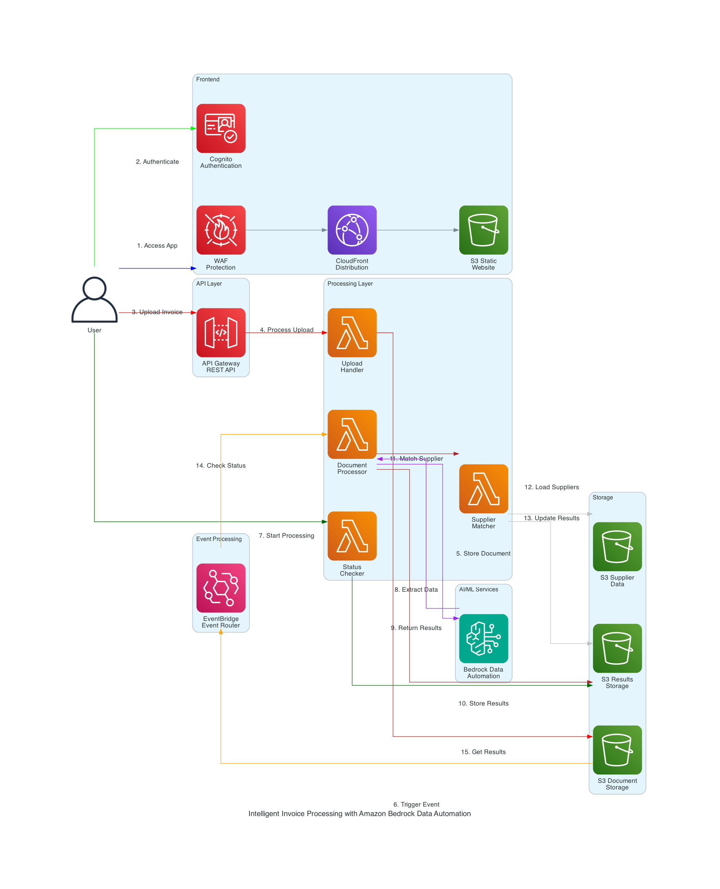

# Invoice Processor

## Overview

A system for processing invoices and matching vendors to suppliers using Amazon Bedrock Data Automation.

## Features

- **Invoice Processing**: Extracts vendor, dates, amounts, line items, and bank details
- **Supplier Matching**: Fuzzy matching to identify vendors in your supplier database  
- **Multi-Format Support**: PDF, PNG, JPG, JPEG, GIF files
- **Processing Dashboard**: Live processing status and results viewer
- **CSV Export**: Export results with matched supplier codes
- **Security**: Authentication, encryption, and WAF protection

## Architecture



**Core Components:**
- **Amazon Bedrock Data Automation**: Custom invoice blueprint for data extraction
- **AWS Lambda**: Document processing and supplier matching
- **Amazon S3**: Document and results storage
- **React Web App**: Modern interface hosted on CloudFront
- **Amazon Cognito**: User authentication

## Deployment Steps

### Prerequisites

1. AWS account 
2. Create IAM role/user with [IAM policy](./docs/iam-policy.json) for deployment
3. AWS CLI (v2.x or later)
4. For Linux/EC2 users, this application requires ARM architecture
5. [Install node and npm](https://docs.npmjs.com/downloading-and-installing-node-js-and-npm), node.js 22 is recommended
6. [Get started with CDK](https://docs.aws.amazon.com/cdk/v2/guide/getting_started.html), and [bootstrap your environment for use](https://docs.aws.amazon.com/cdk/v2/guide/bootstrapping-env.html)
7. [Install Docker](https://www.docker.com/get-started/), because we are bundling Lambda functions when running CDK so we need to install Docker. Please see the blog post about [Building, bundling and deploying applications with the AWS CDK](https://aws.amazon.com/blogs/devops/building-apps-with-aws-cdk/)
8. [Run aws configure](https://docs.aws.amazon.com/cli/latest/reference/configure/set.html) to set up region
```bash
aws configure set region YOUR_REGION
```

### Quick Start

1. Clone this repository
2. Install npm modules
```bash
cd bedrock-agentic-invoice-assistant
npm run install-packages
```
3. Deploy the backend and frontend
```bash
npm run deploy-all
```
To deploy the backend only
```bash
npm run deploy-backend
```
To deploy the frontend only
```bash
npm run deploy-frontend
```
4. Access to the application from [Cloudfront distribution URL](https://docs.aws.amazon.com/AmazonCloudFront/latest/DeveloperGuide/GettingStarted.SimpleDistribution.html), you can get this URL from the Cloudformation output with script:
```bash
aws cloudformation describe-stacks --stack-name $(aws cloudformation list-stacks --stack-status-filter CREATE_COMPLETE UPDATE_COMPLETE | jq -r '.StackSummaries[] | select(.StackName | startswith("AutoInvoiceAPPwebsitewafstack")) | .StackName') --query 'Stacks[0].Outputs[?OutputKey==`configwebsitedistributiondomain`].OutputValue' --output text
```
5. Create cognito user in the user pool to access the application

Note: 
- The deletion will fail if your S3 bucket is not empty
- The WAF stack deletion takes 15-20 minutes
- If CloudFormation deletion fails, review and manually delete these resources in the AWS Console:
  - Bedrock Data Automation project
  - Lambda functions and their associated CloudWatch log groups
  - IAM roles
  - Any remaining S3 buckets and their contents

## Cost Estimation
- Approximate cost: The Invoice Processing Application will cost $53 per month for 1,000 pages, 28,800 requests (us-east-1 region, April 2025)
- Recommend setting up [AWS Budget](https://docs.aws.amazon.com/cost-management/latest/userguide/budgets-managing-costs.html)

### Cost Breakdown

Below you can see the estimated costs of the solution and the assumptions.

| AWS service | Dimensions | Cost [USD] |
|----------|----------|----------|
| Amazon Bedrock Data Automation    | 1,000 documents (each 1 page) processed with Bedrock Data Automation     | $40  |
| AWS Lambda    | 28,800 requests per month on Arm with 512 MB ephemeral storage, 30s execution time     | $0.32     |
| Amazon EventBridge    | 1 million events     | $1     |
| Amazon Simple Storage Service (S3)   |  S3 Standard storage (10 GB per month)     | $0.24     |
| Amazon CloudFront      | Data transfer out to internet cost: $0.85 and Data transfer out to origin cost: $0.20 (10 GB per month), 28,000 requests cost: $0.03  |  $1.08   |
| Amazon Cognito     | 100 monthly active users (MAU) with Advanced security feature (WAF)     | $10.75    |

## Stack Deletion

Delete the stack. We recommend using the AWS CloudFormation service page to delete/manage your CDK stacks as it offers many options to monitor stack drifts, identify errors, and provides better stability.

Note:
- The deletion will fail if your S3 bucket is not empty
- The WAF stack deletion takes 15-20 minutes